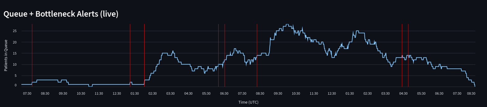
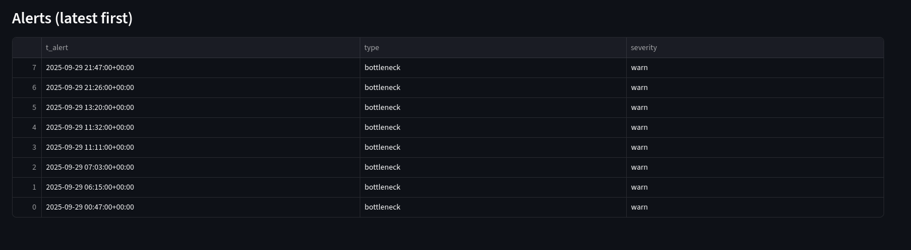
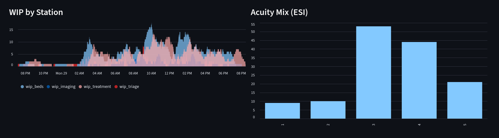

# ER Dashboard (Evidence Pack)

This repository provides **documentation, screenshots, and evaluation artifacts** from a private prototype of an **Emergency Room (ER) operations dashboard** that I built. 

⚠️ **Note:**  
The full implementation code is private for **IP and privacy reasons** (designed for future commercialization and uses only synthetic data).  
This repo is strictly for **application reviewers** to verify the project’s scope and rigor.

---

## What’s Inside

- **docs/**
  - `quickstart.md` – high-level setup and demo instructions (for internal runs only).  
  - `schema.md` – event log schema (synthetic only, no PHI).  
  - `tech_notes.md` – design choices, assumptions, limitations.  

- **reports/**
  - `eval.md` – evaluation results, including:
    - Lead-time gained by automated alerts vs. manual spotting proxy.  
    - Door-to-bed times by ESI level.  
    - LWBS (left-without-being-seen) counts.

- **assets/**
  - Screenshots of the Streamlit dashboard (running only synthetic data).  
  - Architecture diagram.

---

## Highlights

- **Acuity-aware** (ESI 1–5) priority queueing.  
- **Finite bed capacity** → blocking + occupancy tracking.  
- **Optional imaging** branching.  
- **LWBS modeling** when wait > acuity-specific threshold.  
- **Realtime dashboard** with live alerts (red lines) and playback.  
- **Evaluation** shows alerts firing *earlier* than manual spotting thresholds.

---

## Privacy / IP

- 🚫 **No PHI**: all data is generated synthetically via stochastic simulation.  
- 🔒 **Private repo**: implementation code is kept private for commercialization potential.  
- ✅ **Evidence only**: this repo demonstrates outcomes, not source.

---

## Demo Access

A controlled demo of the dashboard can be shared **upon request**. Please contact me directly.

### Overview (Queue + Alerts)
Dashboard view of ER queue length over time. Red dashed lines show early alerts firing before congestion becomes critical

### Alerts Table
Automatically logged alerts with timestamp, type, and severity for auditing

### Playback / WIP
Playback mode showing work-in-progress across stations (triage, beds, imaging, treatment)

